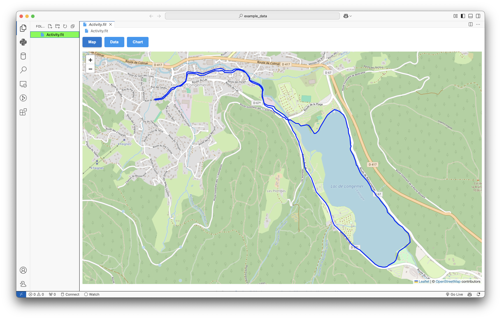
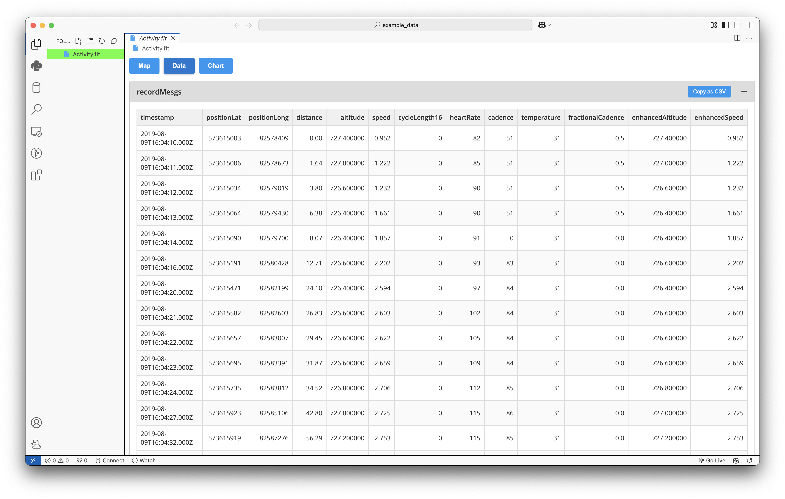
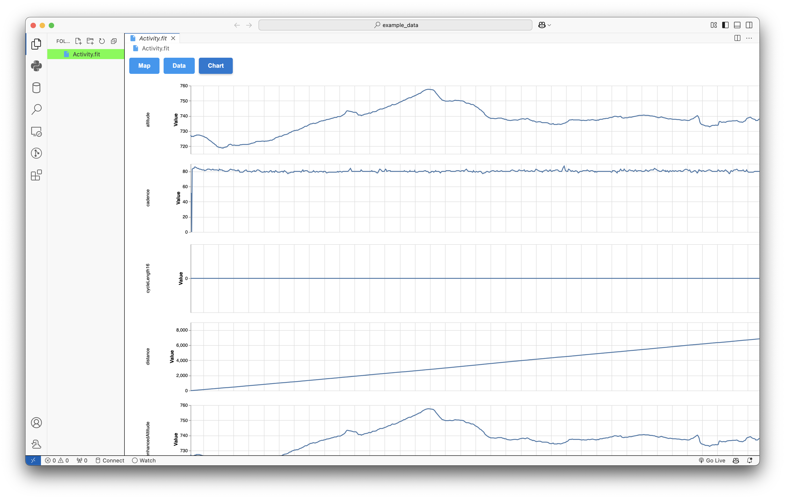

# fit-viewer README

Open `.fit` files within `vscode` . 







## How to install

* Install the extension: Look for `FIT File Viewer` in the [Marketplace](https://marketplace.visualstudio.com/items?itemName=ThomasCamminady.fit-viewer)
* Right-click on a `.fit` file, select `Open with...`
* Click `Configure default editor for '*.fit'...`
* Click `FIT File Viewer`

Now, whenever you click on a `.fit` file it uses `FIT File Viewer` .

## Develop

```
rm -rf node_modules out    
npm install
npm run compile
npm run package
```

Upload extension to `https://marketplace.visualstudio.com/manage/publishers/thomascamminady`

## Disclaimer

No work in this repository is affiliated with my employer, [Wahoo Fitness](http://www.wahoofitness.com). 

## Credit

Uses:
* [https://github.com/garmin/fit-javascript-sdk](https://github.com/garmin/fit-javascript-sdk), Flexible and Interoperable Data Transfer (FIT) Protocol License Agreement
* [https://leafletjs.com](https://leafletjs.com), BSD-2-Clause license
* [https://vega.github.io/vega-lite/](https://vega.github.io/vega-lite/), BSD-3-Clause license
* [https://github.com/vega/vega-embed](https://github.com/vega/vega-embed), BSD-3-Clause license
