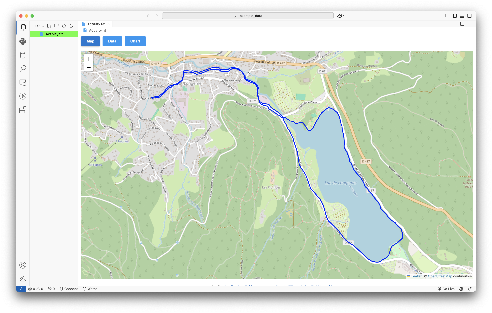
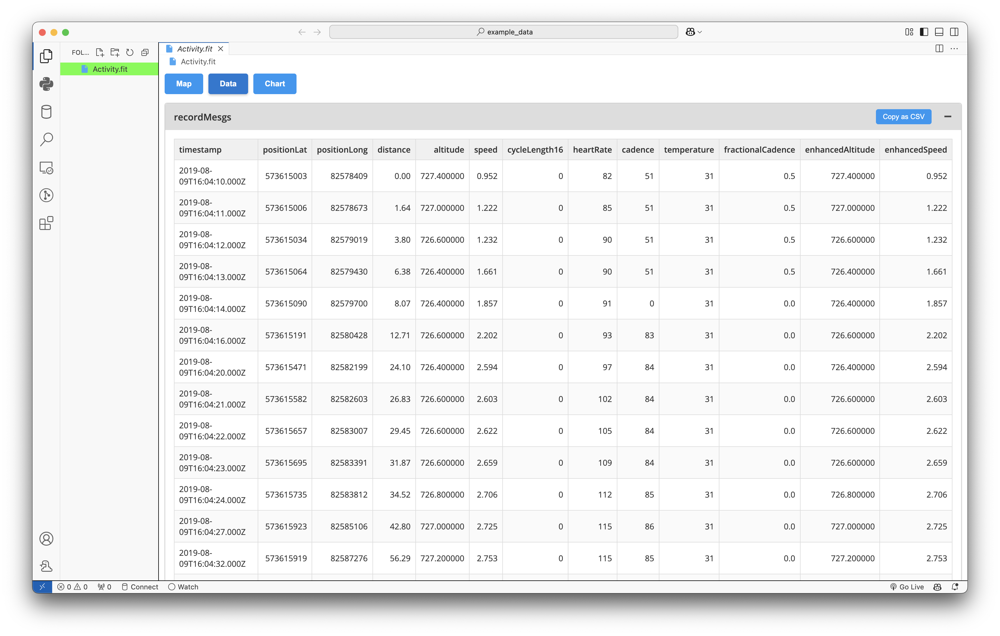
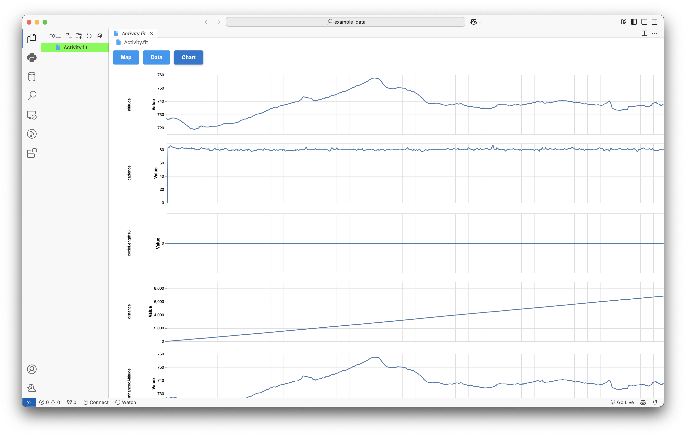

# fit-viewer README

Open `.fit` files within `vscode` . 







## How to install

* Install the extension: Look for `FIT File Viewer` in the [Marketplace](https://marketplace.visualstudio.com/items?itemName=ThomasCamminady.fit-viewer)
* Right-click on a `.fit` file, select `Open with...`
* Click `Configure default editor for '*.fit'...`
* Click `FIT File Viewer`

Now, whenever you click on a `.fit` file it uses `FIT File Viewer` .

# FIT File Viewer

A Visual Studio Code extension for viewing and analyzing `.fit` files with interactive maps, charts, and data tables.

[](https://github.com/thomascamminady/fit-viewer/actions/workflows/ci.yml)
[](https://marketplace.visualstudio.com/items?itemName=ThomasCamminady.fit-viewer)
[](LICENSE.md)


## Features

- 🗺️ **Interactive Maps** - View GPS tracks with Leaflet.js
- 📊 **Data Visualization** - Interactive charts with Vega-Lite
- 📋 **Data Tables** - Sortable and searchable data tables
- 🔍 **Data Export** - Copy data as CSV for external analysis
- 🏃 **Multi-Sport Support** - Works with various activity types

## Installation

### From VS Code Marketplace

1. Open VS Code
2. Go to Extensions (Ctrl+Shift+X / Cmd+Shift+X)
3. Search for "FIT File Viewer"
4. Click Install

### Manual Installation

1. Download the `.vsix` file from [releases](https://github.com/thomascamminady/fit-viewer/releases)
2. In VS Code: `Extensions: Install from VSIX...` command
3. Select the downloaded file

## Usage

1. Open a `.fit` file in VS Code
2. Right-click and select "Open with..."
3. Choose "FIT File Viewer"
4. Set as default editor for `.fit` files (optional)

The viewer provides three tabs:
- **Map**: GPS track visualization
- **Data**: Raw data tables (collapsible)
- **Chart**: Time-series data visualization

## Development Setup

### Prerequisites

- [Node.js](https://nodejs.org/) (version specified in `.nvmrc`)
- [npm](https://www.npmjs.com/) (comes with Node.js)
- [Visual Studio Code](https://code.visualstudio.com/)

### Getting Started

```bash
# Clone the repository
git clone https://github.com/thomascamminady/fit-viewer.git
cd fit-viewer

# Install dependencies
npm install

# Compile TypeScript
npm run compile

# Or run in watch mode
npm run watch
```

### Development Commands

```bash
# Compile the extension
npm run compile

# Watch for changes and recompile
npm run watch

# Lint the code
npm run lint

# Fix linting issues
npm run lint:fix

# Format code with Prettier
npm run format

# Check code formatting
npm run format:check

# Run tests
npm test

# Package extension
npm run package

# Clean build artifacts
npm run clean

# Full rebuild
npm run rebuild
```

### Testing

Run the extension in a new VS Code window:

1. Open this project in VS Code
2. Press `F5` to start debugging
3. In the new window, open a `.fit` file

### Contributing

1. Fork the repository
2. Create a feature branch: `git checkout -b feature/amazing-feature`
3. Make your changes
4. Run tests: `npm test`
5. Commit changes: `git commit -m 'Add amazing feature'`
6. Push to branch: `git push origin feature/amazing-feature`
7. Submit a pull request

Please ensure your code follows the existing style and includes appropriate tests.

## Publishing

```bash
# Build and package
npm run compile
npm run package

# Publish to marketplace (requires access)
vsce publish
```

Upload to [VS Code Marketplace](https://marketplace.visualstudio.com/manage/publishers/thomascamminady)

## Disclaimer 1

No work in this repository is affiliated with my employer, [Wahoo Fitness](http://www.wahoofitness.com). 

## Disclaimer 2

I have no idea what I am doing here. All code was written by ChatGPT and I haven't written a single line of JavaScript or TypeScript on my own. Suggestions to improve this code are very much appreciated.

## Credit

Uses:
* [https://github.com/garmin/fit-javascript-sdk](https://github.com/garmin/fit-javascript-sdk), FIT Protocol License Agreement
* [https://leafletjs.com](https://leafletjs.com), BSD-2-Clause license
* [https://vega.github.io/vega-lite/](https://vega.github.io/vega-lite/), BSD-3-Clause license
* [https://github.com/vega/vega-embed](https://github.com/vega/vega-embed), BSD-3-Clause license
